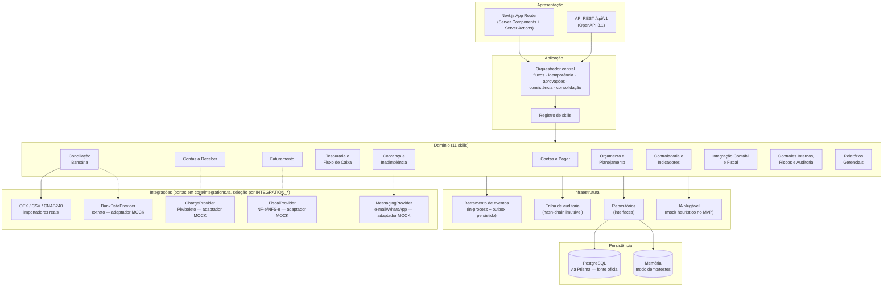

# 3. Arquitetura geral do sistema

## Visão em camadas

## Decisões estruturais

| Decisão | Escolha | Racional |
|---|---|---|
| Fonte oficial de dados | PostgreSQL (Prisma) | Transacional, auditável; IA nunca é fonte |
| Regras financeiras | Código determinístico tipado | Reprodutível, testável, com fórmula exposta |
| Papel da IA | Classificação sugerida, explicação, recomendação | Interface `AiClassifier` plugável; mock heurístico no MVP |
| Comunicação entre skills | Eventos de domínio + orquestração explícita | Skills não se chamam diretamente; o orquestrador resolve dependências |
| Dinheiro | Inteiro de centavos (`number` no domínio, `BigInt` no banco) | Sem float; seguro até dezenas de trilhões de centavos |
| Datas de negócio | `ISODate` string no fuso da empresa | Sem bugs de fuso/DST; carimbos em UTC |
| Idempotência | Chave por requisição (orquestrador) + chave natural por registro (skills) | Dupla proteção contra duplicidade |
| Aprovação humana | Fluxo suspenso → `Approval` → retomada com decisão | Segregação de funções e alçada verificadas no motor |
| Auditoria | Append-only com hash encadeado | Adulteração detectável (`verifyChain`) |
| Multiempresa | `companyId` em toda entidade + RBAC por vínculo | Isolamento lógico por empresa |
| Integrações externas | Portas em `core/integrations.ts` + adaptadores por env (`INTEGRATION_*`) | Mock determinístico como padrão explícito; provedor real não implementado falha alto (nunca fallback silencioso) |

## Ciclo de vida de uma solicitação

1. UI/API autentica o usuário (sessão assinada) e monta o `Actor` com papel na empresa.
2. O **orquestrador** localiza o fluxo, verifica permissão, resolve idempotência e cria o `FlowRun`.
3. Cada passo constrói a entrada da skill a partir do payload + resultados anteriores
   (`FlowStepContext`), executa via `runSkill` (validação Zod, captura de erros, registro de
   `SkillExecution`).
4. Skill lê/escreve pelos **repositórios**, publica **eventos**, registra **auditoria** e devolve
   o **envelope padrão** (status, confiança, alertas, pendências, suposições).
5. Ação sensível → skill devolve `awaiting_approval` + `approvalRequest`; o orquestrador cria a
   `Approval` (papel mínimo pela alçada), suspende o fluxo e alerta os aprovadores.
6. Decisão humana (`decideApproval`) valida alçada + segregação, audita e **retoma o fluxo do
   mesmo passo**, repassando a decisão à skill (que executa ou cancela).
7. Ao final, o orquestrador roda a **validação de consistência** do fluxo e devolve a resposta
   consolidada: resumo, alertas, pendências, suposições e fontes de dados usadas.

## Segurança e LGPD (mecanismos implementados)

- Senhas com scrypt; sessão HttpOnly assinada (HMAC-SHA256, expiração 8h).
- RBAC: 6 papéis × permissões finas (`src/core/auth.ts`); alçada por valor no vínculo.
- Segregação de funções no motor de aprovações (solicitante ≠ aprovador, sempre).
- Dados bancários e chaves Pix **apenas mascarados** no domínio (`accountNumberMasked`,
  `bankInfoMasked`) — o dado completo nunca entra no sistema no MVP.
- Logs e auditoria sem segredos: hash de senha nunca sai da camada de persistência.
- Entrada externa (OFX/CSV, formulários) validada com Zod; conteúdo de documentos tratado como
  dado, nunca como instrução (mitigação de prompt injection: a IA do MVP é heurística local e
  nenhuma saída de IA executa ações — apenas sugere, com aprovação humana à frente de qualquer
  efeito sensível).
- Trilha de auditoria de **todas** as ações humanas e automatizadas, com verificação de integridade.
