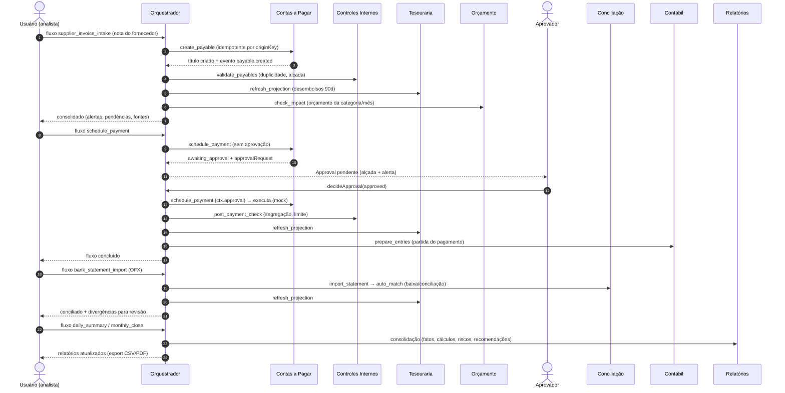

# 7. Regras e pseudocódigo do orquestrador

Implementação real: `src/core/orchestrator/orchestrator.ts` (motor), `flows.ts` (fluxos),
`registry.ts` (registro de skills). Testes: `src/core/__tests__/orchestrator.test.ts`.

## Responsabilidades e regras

1. **Recepção e roteamento** — toda solicitação nomeia um fluxo; o fluxo declara quais skills
   aciona, em que ordem e com que entrada (`buildInput` recebe payload + resultados anteriores).
2. **Permissões** — cada fluxo exige uma permissão (`requiredPermission`); o `Actor` humano é
   verificado contra a matriz RBAC antes de qualquer efeito.
3. **Idempotência (anti-duplicidade)** — chave explícita do chamador ou hash canônico de
   `{flow, payload}`. Requisição repetida ⇒ resposta do cache, **nada reprocessa**. Mesma chave
   com payload diferente ⇒ erro. Falhas **não** gravam idempotência (retry seguro; as escritas
   das skills são idempotentes por chave natural — segunda linha de defesa).
4. **Dependências e contexto** — passos recebem os resultados anteriores por id de passo;
   passos condicionais (`when`) são pulados com registro em `assumptions`.
5. **Aprovação humana** — resultado `awaiting_approval` obriga `data.approvalRequest`; o
   orquestrador cria a `Approval` com papel mínimo derivado da alçada configurada
   (`requiredRoleForAmount`), suspende o fluxo (cursor no próprio passo), alerta e audita.
   A decisão valida: aprovador é humano, pertence à empresa, papel ≥ exigido, valor ≤ limite
   pessoal, **solicitante ≠ aprovador**. Aprovado ⇒ o passo é reexecutado com `ctx.approval`
   e o fluxo continua. Rejeitado ⇒ o passo cancela a ação pendente e o fluxo termina `rejected`.
6. **Falhas e dados incompletos** — erro em passo obrigatório ⇒ fluxo `failed` (auditado, sem
   idempotência gravada); passos marcados `continueOnError` degradam com alerta em vez de parar.
   Integrações indisponíveis lançam `IntegrationUnavailableError` e viram envelope de erro.
7. **Consistência entre skills** — cada fluxo pode declarar `validate(fctx)` que cruza os
   resultados (ex.: a projeção da tesouraria reflete o título recém-criado?) e anexa alertas.
8. **Auditoria** — `flow.started`, `approval.requested/decided`, `flow.completed/failed` na
   trilha hash-chain, com `correlationId` amarrando tudo.
9. **Consolidação** — resposta única com resumo em pt-BR, união de alertas/pendências/suposições
   e **fontes de dados** de todas as skills executadas.

## Pseudocódigo

```
função executar(req):
    fluxo = fluxos[req.flow]                        # desconhecido → erro
    verificar_permissão(req.actor, fluxo.permissão)
    config = configuração_da_empresa(req.companyId)

    chave = req.idempotencyKey ?? hash({flow, payload})
    se cache[chave] existe:
        se cache[chave].hash_payload ≠ hash(payload): erro "chave reutilizada"
        retornar cache[chave].resposta (idempotent_replay = true)

    run = novo FlowRun(status=running, cursor=0, correlationId)
    auditar("flow.started")
    retornar executar_passos(fluxo, run, req.actor, config)

função executar_passos(fluxo, run, actor, config, decisão_aprovação=nulo):
    para i de run.cursor até último_passo:
        passo = fluxo.passos[i]
        fctx  = {payload: run.payload, resultados_por_id, hoje, config}
        se passo.when e não passo.when(fctx): pular (registrar suposição)

        ctx = contexto_da_skill(run, actor, config, decisão_aprovação)
        decisão_aprovação = nulo                    # vale só para o passo retomado
        resultado = runSkill(skills[passo.skill], ctx, passo.buildInput(fctx))
        guardar resultado (substitui o do mesmo passo em retomadas)

        se resultado.status == awaiting_approval:
            approval = criar_Approval(resultado.data.approvalRequest,
                                      papel_mínimo=alçada(config, valor),
                                      solicitante=run.requestedBy)
            run.status = awaiting_approval; run.cursor = i   # mesmo passo reexecuta
            alertar aprovadores; auditar; publicar evento; gravar idempotência
            retornar resposta_consolidada(+approval)

        se resultado.status == error e passo não tolera erro:
            run.status = failed; auditar; retornar resposta   # sem gravar idempotência

        run.cursor = i + 1
        se retomada_foi_rejeição: parar                       # nada mais a executar

    run.status = rejeição ? rejected : completed
    alertas += fluxo.validate(fctx)                # consistência entre skills
    gravar idempotência; auditar; publicar flow.completed
    retornar resposta_consolidada()

função decidir_aprovação(companyId, approvalId, decisão, actor, justificativa):
    approval = buscar(approvalId); exigir status == pending
    exigir actor humano, vínculo na empresa
    exigir papel(actor) ≥ approval.requiredRole
    exigir valor ≤ limite_de_alçada(actor)         # null = ilimitado
    exigir actor.id ≠ approval.requestedBy         # segregação de funções
    exigir actor.id ∉ approval.approverIds         # dupla aprovação: pessoas distintas

    # Dupla aprovação (four-eyes) por faixa: aprovar antes de atingir o total
    # exigido é PARCIAL — registra o aprovador, audita e mantém pending.
    se decisão == approved e |approverIds|+1 < approvalsRequired:
        registrar aprovador; auditar; publicar approval.partially_approved
        retornar {approval}                        # fluxo segue suspenso
    # Uma única rejeição encerra a solicitação, mesmo com aprovações parciais.

    atualizar approval; auditar; publicar approval.decided

    run = fluxo_pendente_por(approvalId)
    se não há run: retornar {approval}             # aprovação avulsa
    retornar executar_passos(fluxo, run, solicitante_original, config,
                             decisão_aprovação={id, status, decidedBy})
```

## Fluxos padrão registrados

| Fluxo | Skills (ordem) | Aprovação |
|---|---|---|
| `supplier_invoice_intake` | AP → Controles → Tesouraria → Orçamento | — |
| `schedule_payment` | AP (agenda→**aprova**→executa) → Controles → Tesouraria → Contábil | Pagamento |
| `bank_statement_import` | Conciliação (importa → concilia) → Tesouraria → Controles | — |
| `bank_sync` | Conciliação (sincroniza via porta de banco, mock → concilia) → Tesouraria → Controles | — |
| `customer_invoice_intake` | Faturamento → AR → Tesouraria | — |
| `dunning_run` | AR (vencidos) → Cobrança (**aprova** envio) → Cobrança (indicadores) | Mensagens |
| `daily_summary` | Tesouraria → AR → Relatórios | — |
| `monthly_close` | Controladoria (DRE) → Orçamento → Controladoria (indicadores) → Contábil → Relatórios | — |
| `accounting_export` | Contábil (prepara) → Contábil (exporta lote) | — |

## Fluxo integrado de exemplo (nota de fornecedor até relatório)


