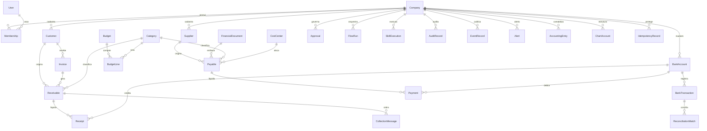

# 8. Modelo de dados e esquema inicial do banco

Fonte oficial: PostgreSQL via Prisma (`prisma/schema.prisma`; migração inicial em
`prisma/migrations/0001_init/migration.sql`). No domínio (`src/core/entities.ts`) os mesmos
tipos aparecem com centavos em `number` e datas de negócio como `YYYY-MM-DD` — a conversão
`BigInt`/`DateTime` acontece só na borda do adaptador Prisma.

## Convenções

- **Multiempresa**: toda entidade de negócio tem `companyId`; unicidades e índices são compostos
  com `companyId`.
- **Dinheiro**: `BigInt` de centavos + `currency` (BRL padrão, estrutura multi-moeda).
- **Datas**: competência/vencimento como `@db.Date`; carimbos `DateTime` UTC.
- **Imutabilidade**: `AuditRecord` e `EventRecord` são append-only (sem update/delete nos
  repositórios).
- **Idempotência**: `Payable.originKey` e `Receivable.originKey` únicos por empresa;
  `BankTransaction (bankAccountId, externalId)` único; `IdempotencyRecord (companyId, key)` único;
  `FinancialDocument (companyId, contentHash)` único.

## Diagrama (entidades principais)



## Entidades e papéis

| Entidade | Papel | Campos-chave |
|---|---|---|
| `Company` | Empresa (multiempresa) | `cnpj` único, `timezone`, `configJson` (alçadas, juros, régua, taxRules) |
| `User` / `Membership` | Usuário global + papel e **limite de alçada** por empresa | `role`, `approvalLimitCents` |
| `Customer` / `Supplier` | Cadastros; fornecedor guarda dados bancários **mascarados** | `document`, `bankInfoMasked`, `pixKeyMasked` |
| `BankAccount` | Conta bancária com saldo inicial e número mascarado | `openingBalanceCents/Date` |
| `BankTransaction` | Linha de extrato importada (assinada: crédito +, débito −) | `externalId` (FITID/hash), `reconciled`, `source`, `importBatchId` (aponta para `StatementImport.id` **sem FK**: lotes anteriores à 0019 não têm linha) |
| `StatementImport` | Lote de importação de extrato: quando entrou, quantas vieram, quantas eram duplicadas e **qual saldo o banco declarava** (`<LEDGERBAL>` do OFX) | `id` = o `importBatchId` das transações; `ledgerBalanceCents`/`ledgerBalanceDate` ausentes em CSV, CNAB240 e sync |
| `Payable` / `Receivable` | Títulos com parcelas, categoria, centro de custo, status e `originKey` | `status`, `paidCents`/`receivedCents`, `installmentNumber/Count` |
| `Payment` | Intenção→execução de pagamento; **nunca `executed` sem `approvalId`** | `status`, `approvalId`, `requestedBy`, `executedBy` |
| `Receipt` | Baixa de recebível (manual ou `registeredBy: "system"` via conciliação) | `method`, `receivedDate` |
| `FinancialDocument` | NF-e/NFS-e/fatura etc., deduplicado por `contentHash` | `type`, `number`, `rawJson` |
| `Category` | Classificação gerencial com grupo de DRE | `kind`, `dreGroup` |
| `CostCenter` / `ChartAccount` | Centro de custo; plano de contas hierárquico | `code` únicos por empresa |
| `Budget` / `BudgetLine` | Orçamento anual com linhas por mês×categoria×centro | `period "YYYY-MM"` |
| `Approval` | Aprovação humana: alvo, valor, papel mínimo, decisor, justificativa | `targetType`, `requiredRole`, `status` |
| `ReconciliationMatch` | Correspondência extrato↔título/liquidação com confiança e histórico | `confidence`, `status`, `matchedBy` |
| `EventRecord` | Outbox de eventos de domínio | `type`, `correlationId`, `causationId` |
| `Alert` | Central de pendências (aberto/reconhecido/resolvido) | `severity`, `code`, `source` |
| `SkillExecution` | Registro de cada execução de skill (hash de entrada, resultado) | `skill`, `action`, `status`, `confidence` |
| `AuditRecord` | Trilha imutável com `seq` e hash encadeado por empresa | `prevHash`, `hash`, `actorType` |
| `Invoice` | Fatura/cobrança; NF-e mock em `nfeMockJson` | `status`, `saleRef` |
| `CollectionMessage` | Mensagem da régua de cobrança (rascunho→aprovação→envio mock) | `step`, `channel`, `status` |
| `AccountingEntry` | Partida dobrada preparada para exportação | `debitAccount`, `creditAccount`, `sourceType/Id`, `exported` |
| `FlowRun` | Execução de fluxo do orquestrador (cursor, resultados, aprovação pendente) | `status`, `cursor`, `idempotencyKey` |
| `IdempotencyRecord` | Cache de respostas por chave de requisição | `(companyId, key)` único |

## Esquema inicial

O SQL da migração inicial é gerado do schema Prisma (sem banco vivo) com:

```bash
npx prisma migrate diff --from-empty --to-schema-datamodel prisma/schema.prisma --script \
  > prisma/migrations/0001_init/migration.sql
```

Aplicação: `npm run db:migrate` (com `DATABASE_URL` apontando para o Postgres do
`docker-compose.yml`) e carga de demonstração com `npm run db:seed`.
